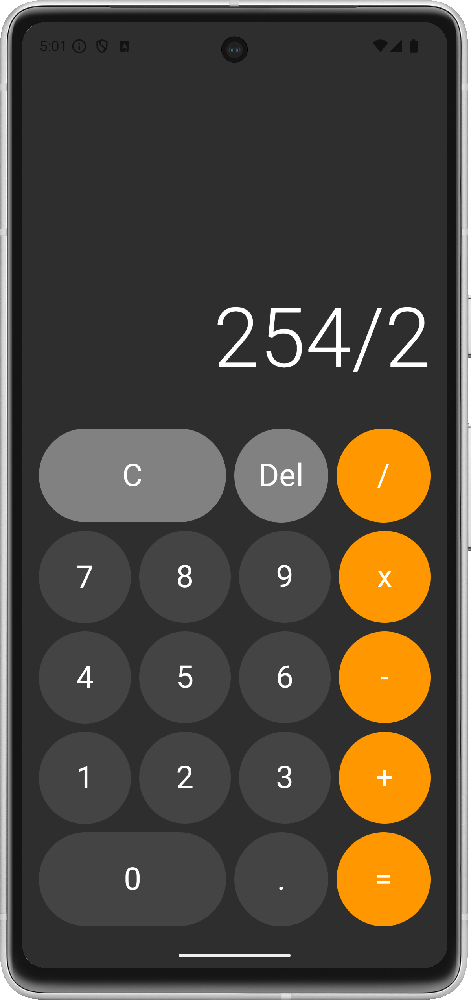

# Calculator

### Create a calculator

Create an app to the following specifications.  
- A user can perform these actions:
    - Clear - Reset current calculation
    - Delete - Removes last typed char (number, operator or decimal)
    - Calculate - Evaluate given equation 
    - Insert number - Enter numbers char 0 - 9
    - Insert decimal - Numbers may be decimals
- A user can perform these operations: Add, Subtract, Multiply, Divide
- A user can see the calculation result and perform further calculations on the result
1080x2400

## Demo

